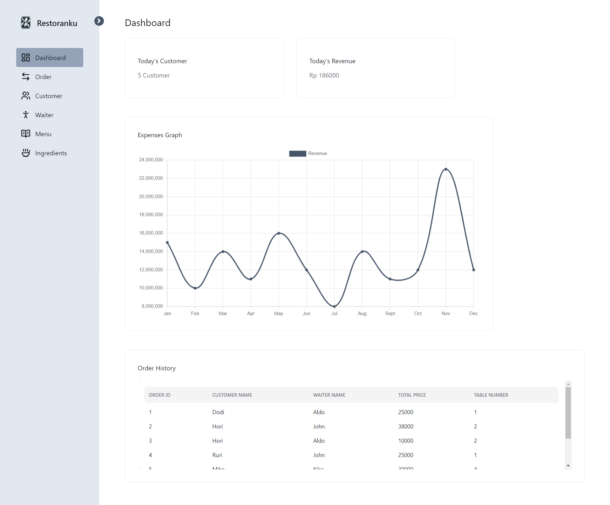
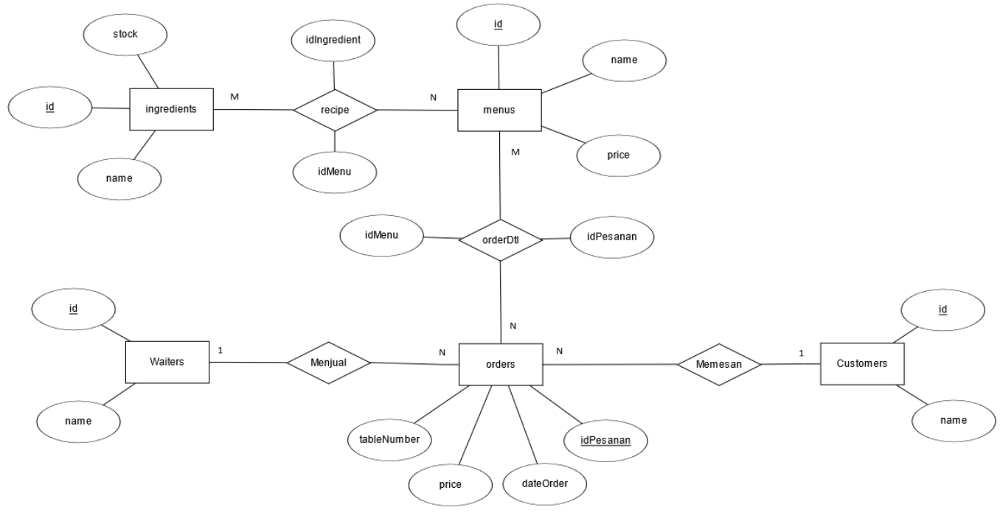

# Kelompok 3

## Member

1. Aaron Kenny Rijadi - 2602115015
2. Reynaldo Marchell Bagas Adji - 2602138214
3. Tannia Aurelle - 2602125823
4. Kristoforus Naidu - 2602117260
5. Sessario Ammar Wibowo - 2602140433

## Information

Restoranku is a powerful dashboard page designed to assist restaurant owners in efficiently monitoring and managing their operations. With its user-friendly interface and comprehensive features, Restoranku provides real-time insights into key aspects of restaurant management, such as sales performance, inventory tracking, and employee scheduling. By centralizing all essential information and tools in one place, Restoranku streamlines daily operations, enhances decision-making, and ultimately helps restaurant owners optimize their business performance. Especially for Small Medium Business, Restoranku is the perfect solution to simplify and streamline your restaurant management tasks.

### Preview



### ER Diagram



### Tools that used in this app

- React JS
- Vite
- Express JS
- MySQL Database
- Tailwind CSS
- NEXT UI
- Framer Motion

## Installation

**NOTES**: Make sure you have installed npm/bun and MySQL on your machine.

1. Clone this repository

```bash
  git clone https://github.com/rmbagt/restoranku.git
```

2.  Go to the project directory and open VS Code

```bash
  cd restoranku
  code .
```

3. Copy all the SQL code in `api/dbRestoranku.sql`

4. Open your terminal and login with your user account

```bash
  mysql -u [username] -p
```

5. Paste the SQL code that you have copied here

6. Change `.env.example` to `.env`, then populate the env

```bash
  # API
  DB_USER=[username]
  DB_PASSWORD=[password]

  # CLIENT
  VITE_API_URL=[your_api_url]

```

7. Open new terminal in api directory, install the dependencies and start the server

```bash
  npm i
  npm start
```

8. Open new terminal in client directory, install the dependencies and start the app

```bash
  npm i
  npm run dev
```

9. The app will run on http://localhost:5173/
